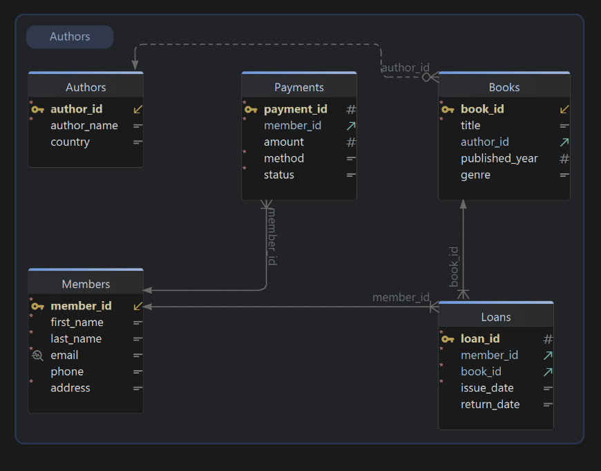

# 📚 Library Database – Data Insertion, Updates & Deletions

## 📌 Introduction
This project is designed to practice **SQL data manipulation** using a **Library Management System** dataset.  
We focus on inserting, updating, and deleting records, while handling **NULL values** and defaults.

We practice:
- Adding records using `INSERT`  
- Handling missing values with `NULL` or defaults  
- Modifying records with `UPDATE ... WHERE`  
- Removing records safely using `DELETE ... WHERE`  

---

## 🚀 How to Run
1. Open **MySQL Workbench** (or SQLite Studio).  
2. Run `schema.sql` to create the database and tables.   
3. Run `data.sql` to insert sample data.  
4. Run `queries.sql` to execute update and delete queries.

## 🛠️ Tools Used
- MySQL Workbench / SQLiteStudio 

---

## 📑 File in this Repo
- `data.sql` → Contains `INSERT`, `UPDATE`, and `DELETE` queries with sample Library data.  

## 📊 ER Diagram
Here’s how everything is connected:

---
##Outcomes:-
After completing this project, you’ll be able to:
-Insert, update, and delete records effectively
-Handle NULL values and defaults
-Maintain data integrity with foreign key relationships
-Write safe and efficient SQL data manipulation queries

